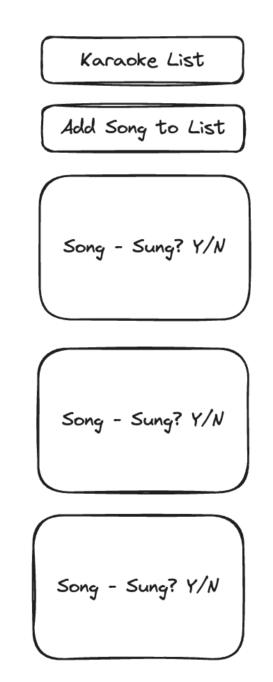
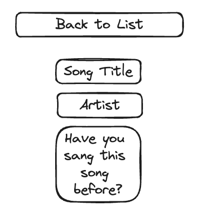
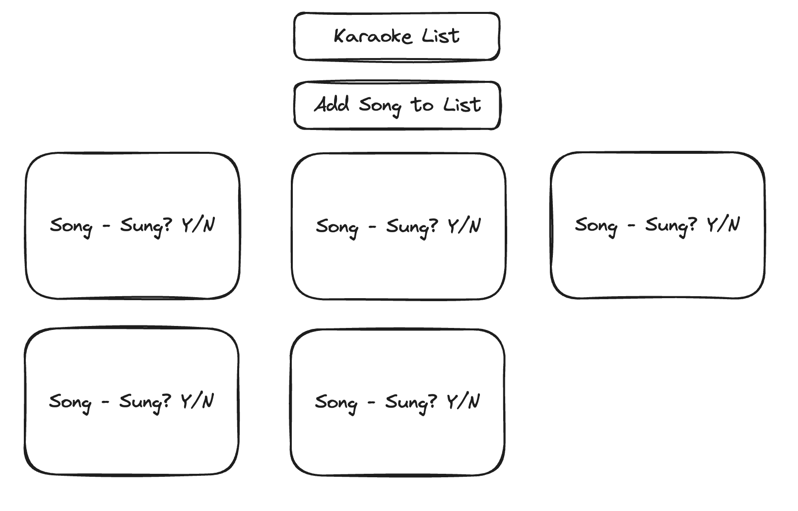
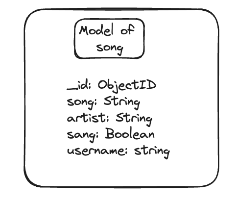
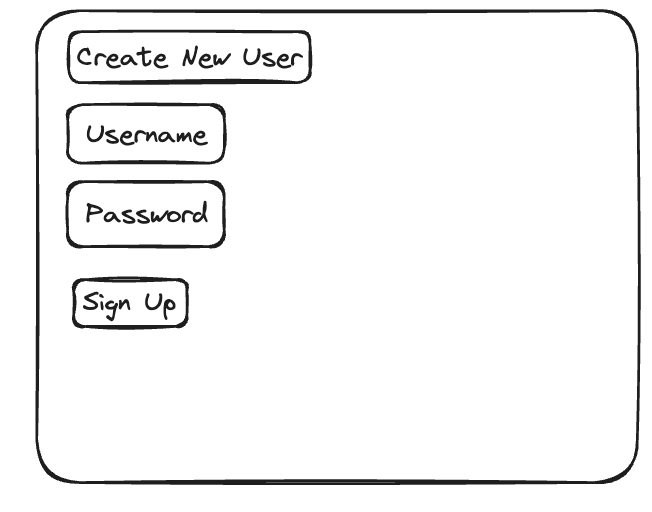
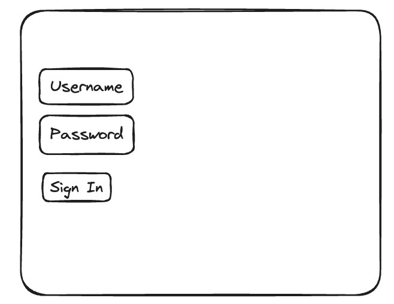
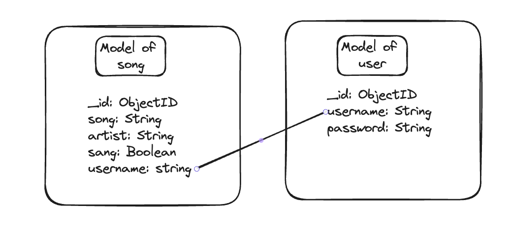

# Project 2

- **Rohan Sinha**
- **Website Name: Karaoke List**
- **Description: Website to track what karaoke songs you are singing or want to sing in the future.**
- **https://github.com/rohansinha01/karaoke-link**
- **https://karaoke-list.onrender.com/songs**
- **https://trello.com/b/z6uODCn8/karaoke**

## List of Dependencies

##### Node Dependencies (package.json)

- bcrypt
- connect-mongo
- dotenv
- ejs
- express
- express-session
- method-override
- mongoose
- morgan

##### Frontend (if used, ex. jquery, alpine, bootstrap, htmx, etc.)

- Javascript
- HTML
- CSS
- Typescript

## Route Map

Below should be a table listing the different routes in your app and their purposes.

| Route Name | Endpoint | Method | Description |
|------------|----------|--------|-------------|
| Karaoke Index | /songs | GET | Renders all songs on a page|
| Karaoke Show Page | /songs/:id | GET | Renders the info for each individual song|
| Karaoke New Page | /songs/new | GET | page to put info to create a new song for the list|
| Karaoke Create Page | /songs | POST | creates a song from the form data from the new page and then redirects back to index |
| Karaoke Edit Page | /karaoke/:id/edit | GET | page to edit the information of the song|
| Karaoke Update Page | /songs/:id | PUT | Update the specific song, then redirect to index |
| Karaoke Delete Page | /songs/:id | DELETE | page to edit the information of the song|
| Karoke Seed Route | /songs/seed | GET | Route to get dummy data onto the page |
| Log In Page | /user/login | GET | Route to log into account |
| Sign Up Page | /user/signup | GET | Route to sign up a new account |
| Logout | /logout | GET | Route to logout of account |

## Design Mockups (Desktop + Mobile)

##### Mobile Design

##### Desktop Design

## ERD (Entity Relationship Diagram)

## Updates

## Authentification Pages

## ERD with Authentification Pages

